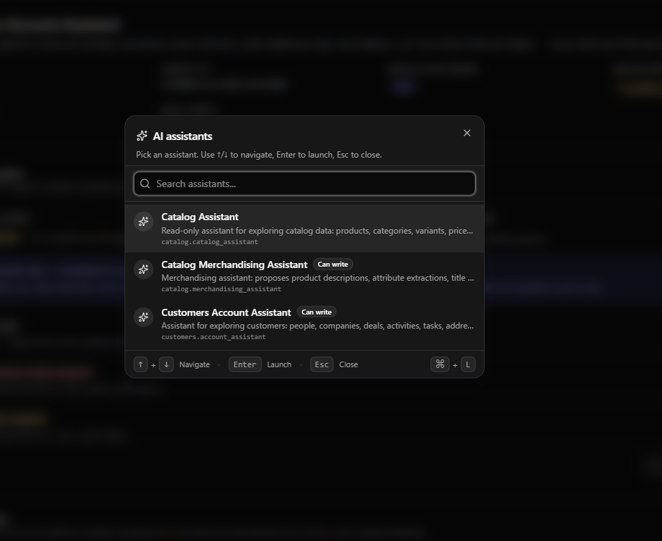
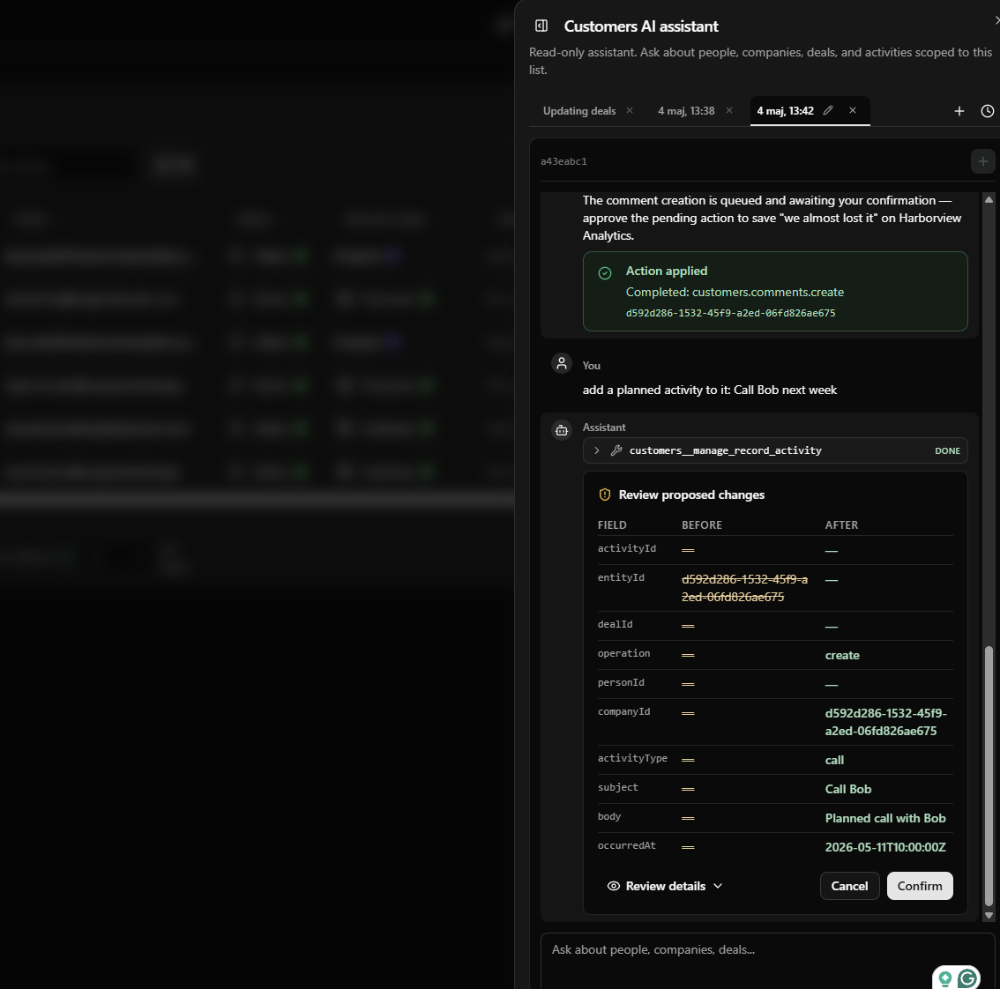

# Operis

A multi-tenant CRM/ERP application foundation: a TypeScript modular monolith with
tenant/organization scoping, feature-based RBAC, module auto-discovery, commands
and events, tenant-partitioned caching, and per-tenant data encryption.

> **Provenance.** Operis is an independent fork of the MIT-licensed open-source
> core of [Open Mercato](https://github.com/open-mercato/open-mercato), taken at
> v0.7.0 (`3019dc23`, 2026-08-22). Open Mercato is the historical architectural
> origin of this codebase — **not** an upstream we track. See [`NOTICE.md`](NOTICE.md)
> for attribution and the commercial components deliberately excluded.

## Documentation

Start here — these describe **this** system, not upstream:

| Document | What it covers |
|---|---|
| [`docs/architecture/multi-tenancy.md`](docs/architecture/multi-tenancy.md) | The canonical tenant/organization model, where isolation is enforced, and the known gaps |
| [`docs/architecture/adr/`](docs/architecture/adr/) | Architecture Decision Records — why this fork differs from upstream |
| [`NOTICE.md`](NOTICE.md) | Fork provenance, MIT attribution, excluded commercial components |
| [`AGENTS.md`](AGENTS.md) | Working conventions for this repository |

Upstream's [documentation site](https://docs.openmercato.com/) remains a useful
*historical* reference for inherited architecture, but where it disagrees with the
code in this repository, the code wins.

## What is intentionally missing

The Open Mercato Enterprise Edition is commercially licensed and is **not** part of
this fork. Operis therefore ships **no MFA and no SSO** — authentication is
password-only at this baseline. This is a known gap, not a design choice; see
[ADR-0002](docs/architecture/adr/ADR-0002-exclude-enterprise-edition.md).

## Architecture at a glance

- 🧩 **Modules** — each feature lives under `src/modules/<module>` with auto-discovered frontend/backend pages, APIs, CLI, i18n, and DB entities.
- 🗃️ **Database** — MikroORM with per-module entities and migrations; no global schema.
- 🧰 **Dependency injection** — Awilix container constructed per request; modules register/override services via `di.ts`.
- 🏢 **Multi-tenant** — the core `directory` module defines `tenants` and `organizations` (a tree). Most entities carry `tenant_id` + `organization_id`, and the query engine **refuses to run a query without a tenant scope**.
- 🔐 **Security** — feature-based RBAC (per-role and per-user), zod validation, bcryptjs hashing, JWT sessions.

## Stack

Next.js App Router · TypeScript · MikroORM (PostgreSQL) · Awilix · zod · Redis · Yarn 4 workspaces + Turbo

## Getting Started

### ⚡ Quick start

This is **the** local development workflow. Every command below was executed against a
freshly dropped database while writing this section; nothing here is aspirational.

#### Prerequisites

| Runtime | Version | Notes |
|---|---|---|
| Node.js | **24.x** | pinned by [`.nvmrc`](.nvmrc) and `engines.node`; `nvm use` picks it up |
| Yarn | **4.17.1** | pinned by `packageManager`; enable with `corepack enable` |
| Docker | any recent | supplies PostgreSQL, Redis and Meilisearch |
| PostgreSQL | **17** (pgvector) | via `docker compose`; the `pgvector` image is required |
| Redis | **7** | via `docker compose`; optional for a single-process dev run |

#### Initial setup

```bash
git clone <repository-url> operis
cd operis

corepack enable                       # Yarn 4 from packageManager
nvm use                               # Node 24 from .nvmrc

docker compose up -d postgres redis   # PostgreSQL + Redis
cp apps/mercato/.env.example apps/mercato/.env

yarn install
yarn build:packages                   # workspace packages the app imports
yarn generate                         # module registries (routes, DI, entities)
yarn db:migrate                       # create the schema
yarn seed:dev                         # create the development tenants and accounts
yarn dev                              # http://localhost:3000
```

#### Environment variables

`apps/mercato/.env.example` is the complete template — copy it and adjust. The
values that must be set for the MVP to run:

| Variable | Purpose |
|---|---|
| `DATABASE_URL` | PostgreSQL connection string. Required; the app fails fast without it. |
| `JWT_SECRET` | Signs session tokens. The template ships a dev placeholder; production refuses to start on a placeholder or a secret under 32 characters. |
| `AUTH_SECRET` | Session/cookie signing, preferred over `JWT_SECRET` when set. |
| `TENANT_DATA_ENCRYPTION` | `yes` by default — user emails and other PII are encrypted at rest. |
| `TENANT_DATA_ENCRYPTION_FALLBACK_KEY` | Derives tenant keys when no KMS/Vault is configured. **Losing it makes existing encrypted rows unreadable.** |
| `REDIS_URL` | Optional locally; required for the event bus and queue in multi-process setups. |
| `OM_DEV_SEED_PASSWORD` | Overrides the password `yarn seed:dev` assigns. Defaults to `Operis!23`. |

#### Database setup

Schema comes entirely from migrations — never create tables by hand.

```bash
yarn db:migrate      # apply all module migrations (safe to re-run)
yarn db:generate     # after changing an entity: emit a new migration to review
```

To wipe local data and rebuild from migrations:

```bash
yarn db:reset --yes    # drops every table, re-applies all migrations
yarn seed:dev          # recreates the development tenants and accounts
```

> `yarn db:greenfield` is **not** a database reset. It also deletes every migration
> file and snapshot from the **source tree** and re-baselines them into one squashed
> migration — a repository rewrite. Use `db:reset` for local data.

#### Seed development data

```bash
yarn seed:dev
```

Idempotent — re-running it creates no duplicate tenant, organization, user, role or
module assignment. It also seeds each module's reference data, so no second command
is needed.

#### Default development accounts

All accounts share the password **`Operis!23`** (override with `OM_DEV_SEED_PASSWORD`).
These are development credentials and are refused when `NODE_ENV=production`.

| Account | Company | Role | Purpose |
|---|---|---|---|
| `admin@operis.local` | **Operis** | `superadmin` | Platform Superadmin — administers the platform and every tenant |
| `admin@acme.local` | Acme | `admin` | Tenant Administrator — administers Acme only |
| `user@acme.local` | Acme | `employee` | Tenant User — restricted day-to-day access |
| `admin@globex.local` | Globex | `admin` | Second tenant, for proving cross-tenant isolation |
| `user@globex.local` | Globex | `employee` | Second-tenant user |

Operis is a **separate company** from any customer tenant. The `superadmin` role
exists only in the Operis tenant, so no tenant administrator can escalate into
platform administration. Globex intentionally has the **`wms` module withheld**, which
is what makes module entitlement observable: Acme sees Warehouse in its navigation,
Globex does not.

Sign in at **http://localhost:3000/login**, then land on **/backend**.

#### Run the development environment

```bash
yarn dev
```

One canonical command. It starts Next.js plus the workers the app needs.
Supporting variants (`yarn dev:verbose`, `yarn dev:app`) exist for narrower use but
are not the documented path.

#### Testing

```bash
yarn typecheck        # TypeScript across every workspace
yarn lint             # ESLint across every workspace
yarn test             # unit tests (Jest)
yarn verify:mvp       # end-to-end MVP scenarios against a running app
yarn test:integration # Playwright integration suite
```

`yarn verify:mvp` needs `yarn dev` running and the seed applied. It signs in as each
seeded account and asserts platform-vs-tenant separation, module entitlement,
cross-tenant isolation, authentication failure handling, health and logout.

#### Health

```bash
curl -fsS http://localhost:3000/api/configs/health
```

Unauthenticated liveness/readiness probe: `200` with `{"status":"ok"}` when the
process is up and can reach its database, `503` otherwise. It deliberately exposes
nothing else — `/api/configs/system-status` carries the detailed, authenticated view.

#### Managing tenant module entitlement

```bash
yarn mercato directory list-tenant-modules --tenant <tenantId>
yarn mercato directory set-tenant-module --tenant <tenantId> --module wms --enabled true
yarn mercato directory sync-tenant-modules            # grant newly added modules to every tenant
```

Entitlement is fail-closed: a tenant reaches a business module only when a
`tenant_modules` row grants it. Tenants created through `mercato init`,
`mercato auth setup`, `yarn seed:dev` or the admin UI are provisioned automatically;
`sync-tenant-modules` backfills tenants that predate a newly added module.

#### Troubleshooting

| Symptom | Cause and fix |
|---|---|
| `DATABASE_URL is not set` | `apps/mercato/.env` is missing — copy it from `.env.example`. |
| Login fails for every seeded account | The seed has not run, or `TENANT_DATA_ENCRYPTION_FALLBACK_KEY` changed since it did (emails are encrypted with it). Reset the database and re-seed. |
| A module is missing from the sidebar | The tenant is not entitled to it. Check `yarn mercato directory list-tenant-modules --tenant <id>`. |
| `Cannot find module '.mercato/generated/...'` | Run `yarn generate` (and `yarn build:packages` first if package sources changed). |
| Stale chunks after switching branches | `yarn dev:reset` clears the Turbopack/Next cache. |
| Port 3000 already in use | Stop the other dev server; the app does not auto-select a port. |
| `DATABASE_URL=… yarn db:migrate` migrated the wrong database | `db:migrate` runs through Turbo, and `turbo.json` declares only `NODE_ENV` in `globalEnv` — every other exported variable is **stripped before the task runs**, so the value in `.env` wins and the command reports success against the wrong database. Edit `apps/mercato/.env`, or bypass Turbo with `yarn workspace @open-mercato/app db:migrate`. |

#### Running multiple persistent local instances

To keep two long-lived local instances pointing at the same PostgreSQL server (e.g. `client-a` next to a stock `open-mercato`), pass an optional database-name override to `yarn dev`:

```bash
# Explicit database name; .env update is offered (default yes)
yarn dev --database-name=my_db

# Derive the database name from the current working directory
yarn dev --database-name

# One-off run that does not touch .env (current child process only)
yarn dev --database-name=review_1720 --no-update-env
```

Without the flag, behavior is unchanged (no prompt, no `.env` mutation).

#### Reducing dev-mode memory usage

`yarn dev` watches every workspace package by default, and the watcher's memory footprint scales with how many packages it tracks. On smaller machines you can narrow the watch scope so only the packages you actually touch stay live — the active mode is printed with an emoji at startup:

```bash
# Watch only packages you've touched recently (git working tree + branch diff)
yarn dev --watch=auto-optimized
OM_WATCH_SCOPE=auto-optimized yarn dev

# Watch only an explicit set of packages
OM_WATCH_SCOPE=env OM_WATCH_PACKAGES=core,ui yarn dev

# Watch only the most frequently changed packages (default cap: 6)
yarn dev --watch=popular
```

Set `OM_WATCH_SCOPE=all` (or `--watch=all`) to restore watching every package. See [Choosing which packages the watcher tracks](https://docs.openmercato.com/appendix/troubleshooting) for the full reference, including `OM_WATCH_POPULAR_LIMIT` and the `git`-detection toggles.

---

### Detailed guides (prerequisites, native services, troubleshooting)

> **These link to upstream Open Mercato's documentation site.** They remain useful for
> platform prerequisites and OS-specific infrastructure setup, but the **Quick start
> above is authoritative for this repository** — where they disagree, follow the Quick
> start. In particular, the standalone-app path (`create-mercato-app`, `yarn setup`)
> does **not** exist in this fork; `packages/create-app` was removed. See
> [`docs/architecture/upstream-coupling-audit.md`](docs/architecture/upstream-coupling-audit.md).

| | Guide |
|---|---|
| 🔧 **Monorepo** — contribute to the core or demo the full platform | [🍎 macOS](https://docs.openmercato.com/installation/monorepo#macos) · [🐧 Linux](https://docs.openmercato.com/installation/monorepo#linux) · [🪟 Windows](https://docs.openmercato.com/installation/monorepo#windows) |
| 🐧 **Windows with WSL2** — Ubuntu on Windows: memory config, Docker, GitHub CLI, native Postgres bridging | [WSL2 guide →](https://docs.openmercato.com/installation/wsl2) |
| 🐳 **Docker dev** — full containerized dev with hot reload, no local toolchain | [All platforms →](https://docs.openmercato.com/installation/docker) |
| 🚀 **VPS / production** — deploy a full stack to any Linux server | [Deploy guide →](https://docs.openmercato.com/installation/vps) |
| 🛠️ **Dev Container** — zero-install VS Code environment | [Setup guide →](https://docs.openmercato.com/installation/devcontainer) |
| ☁️ **Railway** — one-click cloud deployment | [Railway guide →](https://docs.openmercato.com/installation/railway) |

<table>
  <tr>
    <td align="center" valign="top">
      <strong>Getting Started for Core Contributions</strong><br/><br/>
      <a href="https://youtu.be/-ba8Bmc56EQ"></a>
    </td>
    <td align="center" valign="top">
      <strong>Building Standalone App on Linux/Mac</strong><br/><br/>
      <a href="https://www.youtube.com/watch?v=uJn42SLVyI0"></a>
    </td>
    <td align="center" valign="top">
      <strong>How to install Open Mercato on Windows</strong><br/><br/>
      <a href="https://www.youtube.com/watch?v=eX1SqfDPhkU"></a>
    </td>
  </tr>
</table>

---

### 🤖 Learn AI Engineering like we do!

All of our experience building this enterprise-grade ERP is distilled into **[open-mercato/skills](https://github.com/open-mercato/skills)** — re-usable, **technology-agnostic** agent skills for autonomous PR creation, code review, CI stabilization, spec writing, integration testing, and merge management.

Stack-agnostic — install them all with one command:

```bash
npx skills add open-mercato/skills --skill '*'
```

[](https://github.com/open-mercato/skills)

---

## Spec Driven Development

Open Mercato follows a **spec-first development approach**. Before implementing new features or making significant changes, we document the design in the `.ai/specs/` folder.

### Why Specs?

- **Clarity**: Specs ensure everyone understands the feature before coding starts
- **Consistency**: Design decisions are documented and can be referenced by humans and AI agents
- **Traceability**: Each spec maintains a changelog tracking the evolution of the feature

### How It Works

1. **Before coding**: Check if a spec exists in `.ai/specs/` (named `{YYYY-MM-DD}-{title}.md`)
2. **New features**: Create or update the spec with your design before implementation
3. **After changes**: Update the spec's changelog with a dated summary

**Naming convention**: Specs use the format `{YYYY-MM-DD}-{title}.md` (e.g., `2026-01-26-sidebar-reorganization.md`)

See [`.ai/specs/README.md`](.ai/specs/README.md) for the full specification directory and [`.ai/specs/AGENTS.md`](.ai/specs/AGENTS.md) for detailed guidelines on maintaining specs.

### Developing your first Open Mercato app

<table>
  <tr>
    <td align="center" width="50%" valign="top">
      <strong>How to use Open Mercato CRM as a backend for the custom app</strong><br/><br/>
      <a href="https://www.youtube.com/watch?v=y-lxRrAzbYc&t=1s"></a>
    </td>
    <td align="center" width="50%" valign="top">
      <strong>How to build custom landing page with Open Mercato as a backend</strong><br/><br/>
      <a href="https://www.youtube.com/watch?v=fb47pmH6ojE&t=854s"></a>
    </td>
  </tr>
</table>

These walkthroughs show how to treat Open Mercato as a ready-made business backend while keeping the frontend fully custom. You can start from the built-in CRM data model, expose it through the generated APIs, and then build the customer-facing experience around your product's own design. They are a practical path from the default admin setup to a tailored app or landing page powered by Open Mercato.

### Get started without devops hassle

<table>
  <tr>
    <td width="50%" valign="top">
      Start your own Sandbox instance with Claude Code, Codex, Visual Studio Code, and Open Mercato in under 30 seconds.<br/><br/>
      <a href="https://sandboxes.openmercato.com">Launch a Sandbox instance</a>
    </td>
    <td align="center" width="50%" valign="top">
      <a href="https://sandboxes.openmercato.com"></a>
    </td>
  </tr>
</table>

## Official Modules

Open Mercato ships with a module system that lets you add features to your app without forking or modifying the platform. The **[Official Modules](https://github.com/open-mercato/official-modules)** repo is where the community publishes those features.

Every module there:

- 🔌 **Installs in one command** — no manual wiring, no config files to edit
- 🔒 **Stays isolated** — each module is its own npm package that hooks into the platform through declared extension points, never by patching core code
- 🧬 **Is ejectable** — run `--eject` to copy the module into your app and own it fully
- 🤝 **Gets reviewed** — every submission goes through core team review before reaching npm

Whether you're adding a small UI widget or shipping a full vertical feature with its own entities, API routes, and admin pages — if it runs on Open Mercato, it belongs there.

## AI Assistant

Open Mercato ships with focused AI assistants that open inside the admin pages where your team already works. Agents are scoped by module, permissions, and tool allowlists, and any write is staged behind an explicit approval card before data changes.

<table>
  <tr>
    <td><a href="apps/docs/static/screenshots/open-mercato-ai-assistant-available-assistants.png"></a></td>
    <td><a href="apps/docs/static/screenshots/open-mercato-ai-assistant-mutations-approvals.png"></a></td>
  </tr>
  <tr>
    <td style="text-align:center;">Global launcher</td>
    <td style="text-align:center;">Mutation approvals</td>
  </tr>
</table>

Use the global launcher to find every assistant you can access, or embed `<AiChat>` directly in module pages for contextual workflows such as customer account exploration and catalog merchandising. Operators can tune prompts, downgrade mutation policies, and disable individual tools per tenant without redeploying.

- [Getting started](https://docs.openmercato.com/framework/ai-assistant/overview)
- [How to configure it](https://docs.openmercato.com/framework/ai-assistant/settings)
- [User guide](https://docs.openmercato.com/user-guide/ai-assistant)
- [Legacy MCP assistant docs](.ai/specs/implemented/SPEC-012-2026-01-27-ai-assistant-schema-discovery.md)

## Data Encryption

Open Mercato ships with tenant-scoped, field-level data encryption so PII and sensitive business data stay protected while you keep the flexibility of custom entities and fields. Encryption maps live in the admin UI/database, letting you pick which system and custom columns are encrypted; MikroORM hooks automatically encrypt on write and decrypt on read while keeping deterministic hashes (e.g., `email_hash`) for lookups.

Architecture in two lines: Vault/KMS (or a derived-key fallback) issues per-tenant DEKs and caches them so performance stays snappy; AES-GCM wrappers sit in the ORM lifecycle, storing ciphertext at rest while CRUD and APIs keep working with plaintext. Read the docs to dive deeper: [docs.openmercato.com/user-guide/encryption](https://docs.openmercato.com/user-guide/encryption).


## Package versioning

Operis does **not** publish `@open-mercato/*` packages, and it does not consume
them from npm. Every `@open-mercato/*` dependency in this repository resolves to
the local workspace copy via `workspace:*`.

> **Do not** run `yarn add @open-mercato/<pkg>` or
> `npx create-mercato-app@develop`. Those resolve against **upstream's** published
> packages and would pull Open Mercato code — possibly a different major version —
> into this fork, silently reintroducing the coupling the fork exists to remove.
> To change a workspace package, edit it in `packages/`.

The scope name was deliberately retained rather than renamed to `@operis/*`; see
[ADR-0001](docs/architecture/adr/ADR-0001-fork-from-open-mercato.md) § Future
implications.

## Docker Setup

Open Mercato ships two Docker Compose configurations — one for hot-reload development and one for production. Full step-by-step guides with environment variables, troubleshooting, and upgrade instructions:

- 🐳 [Docker dev setup](https://docs.openmercato.com/installation/docker) — hot reload, no local toolchain required
- 🚀 [VPS / production deployment](https://docs.openmercato.com/installation/vps) — full production stack with security guidance and backup instructions
- 🛠️ [Dev Container](https://docs.openmercato.com/installation/devcontainer) — zero-install VS Code environment (12 GB RAM recommended)
- ☁️ [Deploy on Railway](https://docs.openmercato.com/installation/railway) — one-click cloud deployment

## Upstream documentation (historical reference)

The sections below link to **Open Mercato's** documentation and community. They
describe the project Operis was forked from and remain useful for inherited
architecture, but they are not maintained by us and may diverge from this codebase.
For Operis's own documentation see [Documentation](#documentation) above.

Browse upstream's full documentation at [docs.openmercato.com](https://docs.openmercato.com/).

- [Introduction](https://docs.openmercato.com/introduction/overview)
- [Installation](https://docs.openmercato.com/installation)
- [User Guide](https://docs.openmercato.com/user-guide/overview)
- [Tutorials](https://docs.openmercato.com/tutorials/first-app)
- [Customization](https://docs.openmercato.com/customization/build-first-app)
- [Architecture](https://docs.openmercato.com/architecture/system-overview)
- [Framework](https://docs.openmercato.com/framework/modules/overview)
- [API Reference](https://docs.openmercato.com/api/overview)
- [CLI Reference](https://docs.openmercato.com/cli/overview)
- [Appendix](https://docs.openmercato.com/appendix/troubleshooting)

### Open Mercato Discord

The upstream project's community (not an Operis channel): [https://discord.gg/f4qwPtJ3qA](https://discord.gg/f4qwPtJ3qA).

### 🏆 Open Mercato Hall of Fame

Honoring the champions of the **Open Mercato Agentic Hackathon** — Sopot, 10–12 April 2026.

### 🥇 Team MercatoMinds — 378 pts · 36 PRs

| # | Contributor | GitHub | Points | PRs |
|---|-------------|--------|-------:|----:|
| 1 | Michał Strześniewski | [@strzesniewski](https://github.com/strzesniewski) | 106 | 9 |
| 2 | Wiktor Idzikowski | [@WXYZx](https://github.com/WXYZx) | 93 | 11 |
| 3 | Adam Kardasz | [@WH173-P0NY](https://github.com/WH173-P0NY) | 87 | 7 |
| 4 | Karol Roman | [@RMN-45](https://github.com/RMN-45) | 39 | 3 |
| 5 | Adam Kanigowski | [@AK-300codes](https://github.com/AK-300codes) | 29 | 3 |
| 6 | Tomasz Jeleszuk | [@Tomeckyyyy](https://github.com/Tomeckyyyy) | 24 | 3 |

Huge thanks for the incredible energy, craftsmanship, and contributions delivered over the weekend. 🎉

## Contributing

We welcome contributions of all sizes—from fixes and docs updates to new modules. Start by reading [CONTRIBUTING.md](CONTRIBUTING.md) for branching conventions (`main`, `develop`, `feat/<feature>`), release flow, and the full PR checklist. Then check the open issues or propose an idea in a discussion, and:

1. Fork the repository and create a branch that reflects your change.
2. Install dependencies with `yarn install` and bootstrap via `yarn mercato init` (add `--no-examples` to skip demo CRM content; `--stresstest` for thousands of synthetic contacts, companies, deals, and timeline interactions; or `--stresstest --lite` for high-volume contacts without the heavier extras).
3. Develop and validate your changes (`yarn lint`, `yarn test`, or the relevant module scripts).
4. Open a pull request referencing any related issues and outlining the testing you performed.

Refer to [AGENTS.md](AGENTS.md) for deeper guidance on architecture and conventions when extending modules.

### Open Mercato Sponsors

### Blacksmith

<a href="https://www.blacksmith.sh/">
  <picture>
    <source media="(prefers-color-scheme: dark)" srcset="https://raw.githubusercontent.com/useblacksmith/stickydisk/main/Blacksmith_Logo-White-Large.png" />
    <source media="(prefers-color-scheme: light)" srcset="https://raw.githubusercontent.com/useblacksmith/stickydisk/main/Blacksmith_Logo-Black-Large.png" />
    
  </picture>
</a>

Open Mercato's continuous integration is powered by [Blacksmith](https://www.blacksmith.sh/), providing fast and reliable GitHub Actions runners for the project.

### Catch The Tornado

<a href="https://catchthetornado.com/">
  
</a>

Open Mercato is proudly supported by [Catch The Tornado](https://catchthetornado.com/).

## CLI Commands

Open Mercato let the module developers to expose the custom CLI commands for variouse maintenance tasks. Read more on the [CLI documentation](https://docs.openmercato.com/cli/overview)

## License

MIT — see [`LICENSE`](LICENSE), which preserves the original Open Mercato
copyright notice as the MIT license requires.

Provenance, attribution, and the full list of commercially-licensed components
that were **excluded** from this fork are recorded in [`NOTICE.md`](NOTICE.md).

## Enterprise Edition — not included

Open Mercato is open-core: alongside the MIT core it ships a commercial
`@open-mercato/enterprise` package (MFA, SSO/directory sync, step-up
authentication, pessimistic record locking).

**That package is not part of Operis.** Its license forbids production use,
reproduction, and derivation without a commercial license from Open Mercato
sp. z o.o., which this repository does not hold.

Consequences and the clean-room path to reimplementing those capabilities are in
[ADR-0002](docs/architecture/adr/ADR-0002-exclude-enterprise-edition.md).
